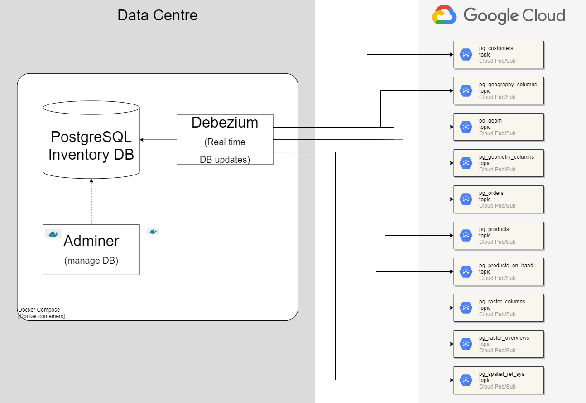

# PoC for Debezium CDC

This project is a PoC that shows how to do CDC from a PostgreSQL database to Pub/Sub 
topics using Debezium. 

CDC stands for [Change Data Capture](https://en.wikipedia.org/wiki/Change_data_capture), from Wikipedia: 

>In databases, change data capture (CDC) is a set of software design patterns used to determine and track the data that has changed so that action can be taken using the changed data.

[Debezium](https://debezium.io/) is an open source distributed platform for change data capture. Start it up, point it at your databases, and your apps can start responding to all of the inserts, updates, and deletes that other apps commit to your databases. Debezium is durable and fast, so your apps can respond quickly and never miss an event, even when things go wrong.



## Running this example

Clone this repo. After cloning go to the project root. Run this command:

```
docker-compose -f postgresql-debezium/docker-compose.yml up
```

You can now go to GCP and watch messages appearing in the topics list in the bottom of
this README.

To explore the PostgreSQL Inventory database open `http://localhost:8080` in a browser 
and fill the following values: `System -> PostgreSQL`, `Server -> db-inventory`, 
`Username -> postgres`, `Password -> example` and `Database -> postgres`. After login 
you need to choose `Schema -> inventory`.

### Service account

You need to create a service account with the role `Pub/Sub Publisher`. Generate a key and place
it in folder `keys`. Reference variable `GOOGLE_APPLICATION_CREDENTIALS` to the generated key 
in file `postgresql-debezium/docker-compose.yml`.

### Prerequisites

You need to have Docker installed in your local machine.

## Commit script

The `commit.cloudbuild.yaml` script performs the following tasks:

1. checks if Pulumi script code conforms with pep8 using [autopep8](https://pypi.org/project/autopep8/);
1. runs Pulumi in `up` mode on `dev`.

This script runs whenever there is a commit to a non master branch.

## Pull request script

The `pr.cloudbuild.yaml` script perform the following tasks:

1. checks if documentation is up to date; and
1. runs integration tests in `dev` environment.
1. Static checks on Python code using [mypy](http://mypy-lang.org/).

This script runs whenever there is a pull request.

## Deploy script

The `deploy_to_preprod.cloudbuild` deploys the cloud functions  in a 
target environmet (project). It runs integration tests in the target environment. Steps:

1. runs integration tests in `UAT` environment;
1. runs Pulumi in `up` mode on `UAT`.


## Manage versions

To increase the project version use [bumpversion](https://pypi.org/project/bumpversion/) 
using this command:

```
bumpversion --config-file .bumpversion.cfg  major|minor|patch 
```

Notice that we are using [semantic versioning](https://semver.org/).

## Generate project documentation

To generate documentation on your local machine run on the project's root:
```
pydoc-markdown
```
The above command uses configurations stored on file `pydoc-markdown.yaml`. Documentation 
will be created in folder `docs`.  Refer to [pydoc-markdown](https://pypi.org/project/pydoc-markdown/) 
for more information.

## Pep8 complaisant code

To make your code conform with pep8 run [autopep8](https://pypi.org/project/autopep8/) 
from the project's root folder:

```
autopep8 --in-place --exit-code --verbose __main__.py
autopep8 --in-place --exit-code --verbose infra/pulumi/pubsub.py
autopep8 --in-place --exit-code --verbose infra/pulumi/services.py
```

It will reformat your code non-aggressively.

## Type check

Type check for Python 3 is performed using [mypy](http://www.mypy-lang.org/), run 
mypy from the project's root folder:

```
mypy __main__.py
mypy infra/pulumi/pubsub.py
mypy infra/pulumi/services.py
```

Default configurations are stored in file `.mypy.ini`.

## Pub/Sub topics

Debezium streams Database updates in real time to Pub/Sub topics. There is one
topic for each table in the inventory database, in our example topics are:
- db-inventory.inventory.customers
- db-inventory.inventory.geography_columns
- db-inventory.inventory.geom
- db-inventory.inventory.geometry_columns
- db-inventory.inventory.orders
- db-inventory.inventory.products
- db-inventory.inventory.products_on_hand
- db-inventory.inventory.raster_columns
- db-inventory.inventory.raster_overviews
- db-inventory.inventory.spatial_ref_sys

Subscriptions with the corresponding names are also generated so that messages are preserved 
for 7 days.
# postgresql-streaming-pubsub
